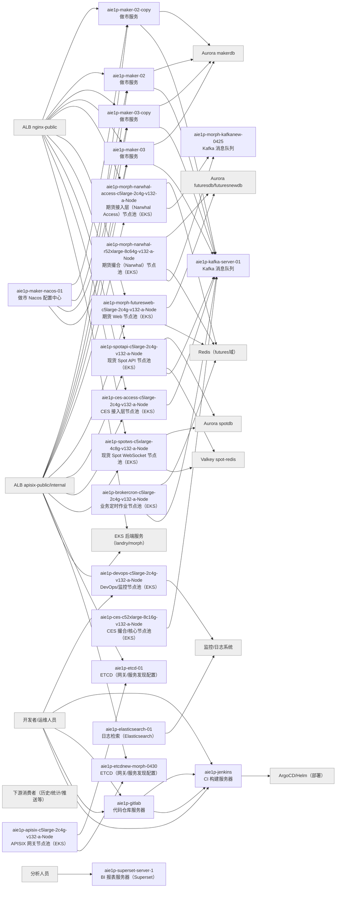

# 生产环境 EC2 服务与上下游关系清单（AI Ops List.xlsx）

以下为 **逐台 EC2** 的“实例名称 / 服务角色 / 主要上游 / 主要下游”清单（仅生产环境；已排除测试/临时用途条目）。

| 实例名称 | 服务角色 | 主要上游 | 主要下游 |
| --- | --- | --- | --- |
| aie1p-maker-02-copy | 做市服务 | Nacos；业务API（经 APISIX/NGINX） | Aurora makerdb；Kafka（可选） |
| aie1p-maker-02 | 做市服务 | Nacos；业务API（经 APISIX/NGINX） | Aurora makerdb；Kafka（可选） |
| aie1p-maker-03-copy | 做市服务 | Nacos；业务API（经 APISIX/NGINX） | Aurora makerdb；Kafka（可选） |
| aie1p-maker-03 | 做市服务 | Nacos；业务API（经 APISIX/NGINX） | Aurora makerdb；Kafka（可选） |
| aie1p-maker-nacos-01 | 做市 Nacos 配置中心 | 做市服务器（maker-*） | 配置数据（本机/磁盘） |
| aie1p-morph-narwhal-r52xlarge-8c64g-v132-a-Node | 期货撮合（Narwhal）节点池（EKS） | Narwhal Access | Kafka；Aurora futuresdb；Redis |
| aie1p-morph-narwhal-r52xlarge-8c64g-v132-a-Node | 期货撮合（Narwhal）节点池（EKS） | Narwhal Access | Kafka；Aurora futuresdb；Redis |
| aie1p-morph-narwhal-access-c5large-2c4g-v132-a-Node | 期货接入层（Narwhal Access）节点池（EKS） | APISIX/NGINX/客户端 | Narwhal 核心；Kafka；futuresdb/Redis |
| aie1p-morph-futuresweb-c5large-2c4g-v132-a-Node | 期货 Web 节点池（EKS） | APISIX/NGINX | Aurora futuresdb/futuresnewdb；Redis |
| aie1p-apisix-c5large-2c4g-v132-a-Node | APISIX 网关节点池（EKS） | ALB apisix-public/internal；客户端 | EKS 后端服务；ETCD |
| aie1p-apisix-c5large-2c4g-v132-a-Node | APISIX 网关节点池（EKS） | ALB apisix-public/internal；客户端 | EKS 后端服务；ETCD |
| aie1p-spotapi-c5large-2c4g-v132-a-Node | 现货 Spot API 节点池（EKS） | APISIX/NGINX | Aurora spotdb；Valkey spot-redis；Kafka（按需） |
| aie1p-devops-c5large-2c4g-v132-a-Node | DevOps/监控节点池（EKS） | 运维人员/系统 | K8S API；监控/日志系统 |
| aie1p-brokercron-c5large-2c4g-v132-a-Node | 业务定时作业节点池（EKS） | 调度/内部触发 | 各业务库；Redis；Kafka |
| aie1p-ces-access-c5large-2c4g-v132-a-Node | CES 接入层节点池（EKS） | APISIX/NGINX/客户端 | CES 核心；Kafka；spotdb/spot-redis |
| aie1p-spotws-c5xlarge-4c8g-v132-a-Node | 现货 Spot WebSocket 节点池（EKS） | APISIX/NGINX | Aurora spotdb；Valkey spot-redis |
| aie1p-ces-c52xlarge-8c16g-v132-a-Node | CES 撮合/核心节点池（EKS） | CES 接入层 | Kafka；spotdb；spot-redis |
| aie1p-jenkins | CI 构建服务器 | 开发者；GitLab Webhook | 制品库（ECR/S3）；ArgoCD/Helm |
| aie1p-gitlab | 代码仓库服务器 | 开发者 | Jenkins/Runner |
| aie1p-etcd-01 | ETCD（网关/服务发现配置） | APISIX/内部系统 | —— |
| aie1p-kafka-server-01 | Kafka 消息队列 | Narwhal/CES/业务服务（生产者） | 历史/统计/推送等（消费者） |
| aie1p-elasticsearch-01 | 日志检索（Elasticsearch） | 应用/网关日志 | 观测/分析 |
| aie1p-morph-kafkanew-0425 | Kafka 消息队列 | Narwhal/CES/业务服务（生产者） | 历史/统计/推送等（消费者） |
| aie1p-etcdnew-morph-0430 | ETCD（网关/服务发现配置） | APISIX/内部系统 | —— |
| aie1p-devops-c5large-2c4g-v132-a-Node | DevOps/监控节点池（EKS） | 运维人员/系统 | K8S API；监控/日志系统 |
| aie1p-morph-narwhal-access-c5large-2c4g-v132-a-Node | 期货接入层（Narwhal Access）节点池（EKS） | APISIX/NGINX/客户端 | Narwhal 核心；Kafka；futuresdb/Redis |
| aie1p-superset-server-1 | BI 报表服务器（Superset） | 分析人员 | Aurora 只读实例（spotdb 等） |
| aie1p-morph-narwhal-access-c5large-2c4g-v132-a-Node | 期货接入层（Narwhal Access）节点池（EKS） | APISIX/NGINX/客户端 | Narwhal 核心；Kafka；futuresdb/Redis |

## 拓扑（Mermaid）

> 说明：图中灰色节点为上下游**类别/托管资源**（非EC2），白色节点为本清单中的 EC2 实例。

