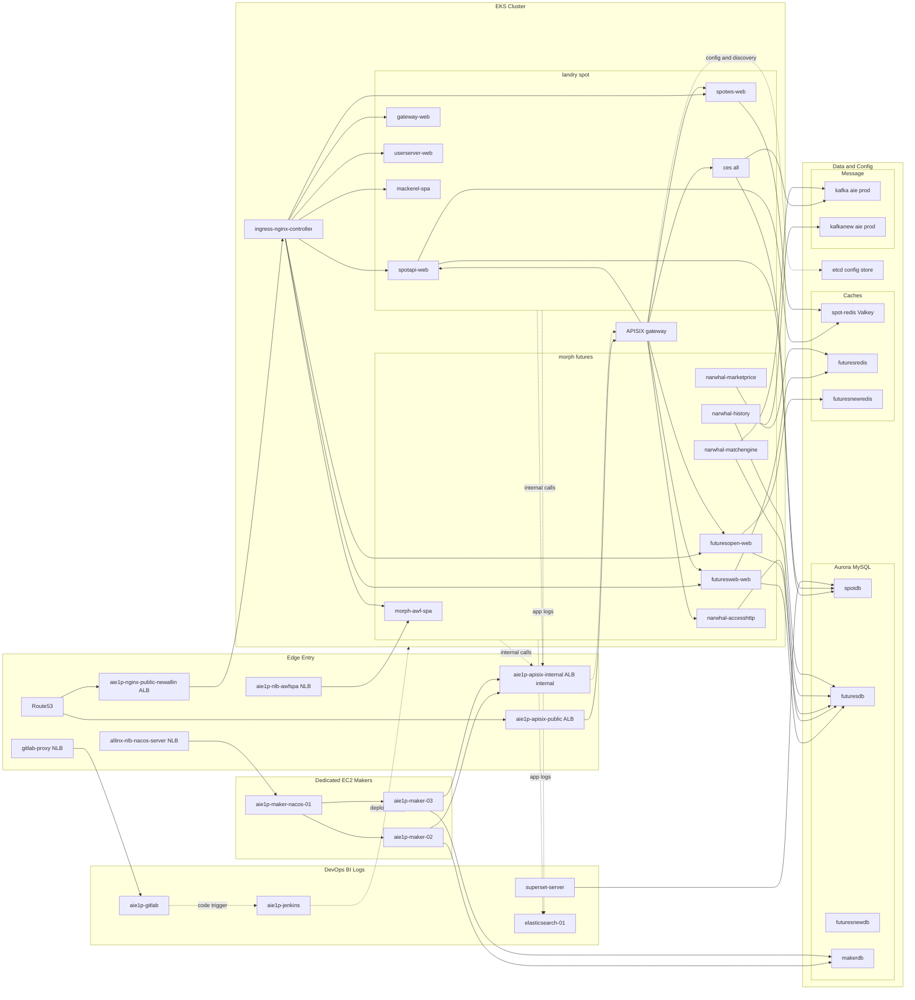

```mermaid
flowchart LR
  subgraph EDGE[Edge Entry]
    R53[Route53]
    ALB_NGINX[aie1p-nginx-public-newallin ALB]
    ALB_APISIX_PUB[aie1p-apisix-public ALB]
    ALB_APISIX_INT[aie1p-apisix-internal ALB internal]
    NLB_AWFSPA[aie1p-nlb-awfspa NLB]
    NLB_NACOS[allinx-nlb-nacos-server NLB]
    NLB_GITLAB[gitlab-proxy NLB]
  end

  subgraph EKS[EKS Cluster]
    IGX[ingress-nginx-controller]
    APISIX[APISIX gateway]
    subgraph LANDRY[landry spot]
      SPOTAPI[spotapi-web]
      SPOTWS[spotws-web]
      CES[ces all]
      GATEWAY[gateway-web]
      USER[userserver-web]
      MACK[mackerel-spa]
    end
    subgraph MORPH[morph futures]
      AWFSPA[morph-awf-spa]
      FUTWEB[futuresweb-web]
      FUTOPEN[futuresopen-web]
      NAR_ACC[narwhal-accesshttp]
      NAR_ME[narwhal-matchengine]
      NAR_MKT[narwhal-marketprice]
      NAR_HIS[narwhal-history]
    end
  end

  subgraph DATA[Data and Config]
    subgraph AUR[Aurora MySQL]
      SPOTDB[spotdb]
      FUTDB[futuresdb]
      FUTNEWDB[futuresnewdb]
      MAKERDB[makerdb]
    end
    subgraph CACHE[Caches]
      SPOTREDIS[spot-redis Valkey]
      FUTREDIS[futuresredis]
      FUTNEWREDIS[futuresnewredis]
    end
    subgraph MQ[Message]
      KAFKA[kafka aie prod]
      KAFKANEW[kafkanew aie prod]
    end
    ETCD[etcd config store]
  end

  subgraph MM[Dedicated EC2 Makers]
    NACOS[aie1p-maker-nacos-01]
    MAKER02[aie1p-maker-02]
    MAKER03[aie1p-maker-03]
  end

  subgraph TOOL[DevOps BI Logs]
    GITLAB[aie1p-gitlab]
    JENKINS[aie1p-jenkins]
    SUPERSET[superset-server]
    ELK[elasticsearch-01]
  end

  R53 --> ALB_NGINX --> IGX
  R53 --> ALB_APISIX_PUB --> APISIX

  IGX --> SPOTAPI
  IGX --> SPOTWS
  IGX --> GATEWAY
  IGX --> USER
  IGX --> FUTWEB
  IGX --> FUTOPEN
  IGX --> AWFSPA
  IGX --> MACK

  APISIX --> SPOTAPI
  APISIX --> SPOTWS
  APISIX --> CES
  APISIX --> FUTWEB
  APISIX --> FUTOPEN
  APISIX --> NAR_ACC

  LANDRY -. internal calls .-> ALB_APISIX_INT
  ALB_APISIX_INT -.-> APISIX
  MORPH -. internal calls .-> ALB_APISIX_INT

  APISIX -. config and discovery .-> ETCD

  NLB_AWFSPA --> AWFSPA
  NLB_GITLAB --> GITLAB
  NLB_NACOS --> NACOS

  SPOTAPI --> SPOTDB
  SPOTAPI --> SPOTREDIS
  SPOTWS --> SPOTREDIS
  CES --> SPOTDB
  CES --> KAFKA

  FUTWEB --> FUTDB
  FUTWEB --> FUTREDIS
  FUTOPEN --> FUTDB
  FUTOPEN --> FUTNEWREDIS
  NAR_ACC --> FUTDB
  NAR_ME --> KAFKA
  NAR_ME --> FUTDB
  NAR_MKT --> FUTREDIS
  NAR_HIS --> FUTDB
  NAR_HIS --> KAFKANEW

  MAKER02 --> ALB_APISIX_INT
  MAKER03 --> ALB_APISIX_INT
  MAKER02 --> MAKERDB
  MAKER03 --> MAKERDB
  NACOS --> MAKER02
  NACOS --> MAKER03

  GITLAB -. code trigger .-> JENKINS
  JENKINS -. deploy update .-> EKS
  LANDRY -. app logs .-> ELK
  MORPH -. app logs .-> ELK
  SUPERSET --> SPOTDB
```
