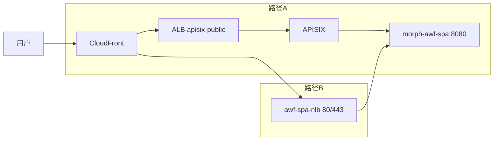
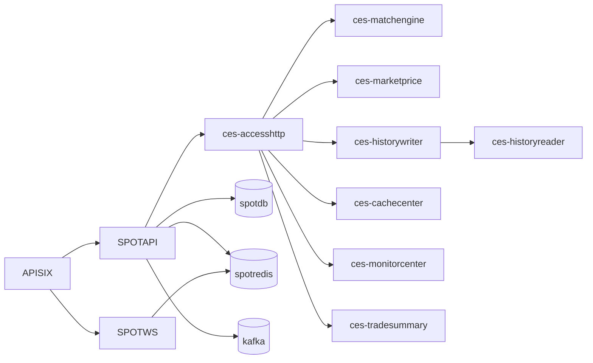

# 业务数据流转拓扑图（生产环境）

> 依据《脚本整理和梳理.pdf》《ALLIN 升级 morph 基础架构部署方案.pdf》《ALLIN nginx-ingress 配置详解 allinx.io》中的路由、Ingress/LB、服务清单与中间件配置整理。仅覆盖生产环境与对外入口。

---

## 1. 自顶向下的流量路径（概览图）

```mermaid
flowchart TB

%% =============== 顶层入口（DNS / CDN / LB / GW） ===============
U[用户 / 客户端]
DNS[DNS]
CF[CloudFront]
ALB_PUB[ALB aie1p-apisix-public]
ALB_INT[ALB aie1p-apisix-internal]
NLB_AWF[NLB awf-spa-nlb<br/>ports 80,443<br/>external]
APISIX[APISIX 网关]
INGRESS_NGX[ingress-nginx-controller<br/>svc 80,443]

U --> DNS --> CF
CF --> ALB_PUB
DNS --> ALB_INT
CF --> NLB_AWF
ALB_PUB --> APISIX
ALB_INT --> APISIX
NLB_AWF --> M_AWF_SPA

%% =============== Landry（现货域） ===============
subgraph LANDRY[Landry 命名空间（现货域）]
  L_ANEMONE[landry-anemone-web<br/>svc 8080]
  L_APA_SPA[landry-apa-spa<br/>svc 8080]
  L_AWFTEST[landry-awftest-spa<br/>svc 8080]
  L_BROKER_SVR[landry-brokerserver-web<br/>NodePort 8080→30864]
  L_CES_ACCESS[landry-ces-accesshttp<br/>svc 8080]
  L_CES_CACHE[landry-ces-cachecenter<br/>svc 7810,7811,7812,7813,7802,7803]
  L_CES_HISTR[landry-ces-historyreader<br/>svc 7516]
  L_CES_HISTW[landry-ces-historywriter<br/>no svc]
  L_CES_MKTPR[landry-ces-marketprice<br/>svc 7416]
  L_CES_MATCH[landry-ces-matchengine<br/>svc 7316]
  L_CES_MON[landry-ces-monitorcenter<br/>svc 5555]
  L_CES_SUM[landry-ces-tradesummary<br/>svc 7519]
  L_CLAIRVOY[landry-clairvoy-web<br/>NodePort 8080→30906,9000→31816]
  L_COBOCB[landry-cobocb-web<br/>svc 8080]
  L_COBOGW[landry-cobogw-web<br/>svc 8080]
  L_GATEWAY[landry-gateway-web<br/>svc 8080]
  L_MACK_SPA[landry-mackerel-spa<br/>svc 8080]
  L_SPOTAPI[landry-spotapi-web<br/>svc 8080]
  L_SPOTTASK[landry-spottask-web<br/>svc 8080]
  L_SPOTWS[landry-spotws-web<br/>svc 8080]
  L_TG_BOT[landry-tgsggd-bot<br/>no port]
  L_TRANS[landry-trans-web<br/>NodePort 8080→31603,9000→31562]
  L_USER[landry-userserver-web<br/>svc 8080]
end

%% =============== Morph（合约域） ===============
subgraph MORPH[Morph 命名空间（合约域）]
  M_AWF_SPA[morph-awf-spa<br/>svc 8080]
  M_AWFTEST[morph-awftest-spa<br/>svc 8080]
  M_COND[morph-cond-web<br/>svc 8080]
  M_FADMIN[morph-futuresadmin-web<br/>svc 8080]
  M_FMKT[morph-futuresmarket-app<br/>svc 8080]
  M_FOPEN[morph-futuresopen-web<br/>svc 8080]
  M_FSCHED[morph-futuresschedule-app<br/>svc 8080]
  M_FWEB[morph-futuresweb-web<br/>svc 8080]
  M_FWS[morph-futuresws-app<br/>svc 8080]
  M_ACCESSHTTP[morph-narwhal-accesshttp<br/>svc 8080 + agent 8888]
  M_ALERT[morph-narwhal-alertcenter<br/>svc 4444 + 8888]
  M_CACHE[morph-narwhal-cachecenter<br/>svc 7810,7802,7803 + 8888]
  M_HISTR[morph-narwhal-historyreader<br/>svc 7516 + 8888]
  M_HISTW[morph-narwhal-historywriter<br/>no svc + 8888]
  M_MKTIDX[morph-narwhal-marketindex<br/>svc 7901 + 8888]
  M_MKTPR[morph-narwhal-marketprice<br/>svc 7416 + 8888]
  M_MATCH[morph-narwhal-matchengine<br/>svc 7316,8316 + 8888]
  M_MON[morph-narwhal-monitorcenter<br/>svc 5555 + 8888]
  M_OPLOG[morph-narwhal-operlogcompact<br/>no svc]
  M_SUM[morph-narwhal-tradesummary<br/>svc 7519 + 8888]
  M_SUB[morph-sub-web<br/>svc 8080]
end

%% =============== Moth（NEXS） ===============
subgraph MOTH[Moth 命名空间（NEXS）]
  N_GW[moth-nexs-gateway<br/>svc 8080]
  N_MKT[moth-nexs-market<br/>svc 9090]
  N_TRD[moth-nexs-trade<br/>svc 9090]
  N_UC[moth-nexs-usercenter<br/>svc 9090]
end

%% =============== 数据层 / 中间件 ===============
subgraph DATA[数据层 / 中间件]
  SPOTDB[(spotdb.aie.prod<br/>RDS)]
  SPOTREDIS[(spotredis.aie.prod<br/>Redis)]
  KAFKA[(kafka.aie.prod:9092<br/>Kafka)]
  FUTDB[(futuresnewdb.aie.prod<br/>RDS)]
  FUTREDIS[(futuresnewredis.aie.prod:6379<br/>Redis)]
  KAFKANEW[(kafkanew.aie.prod:9092<br/>Kafka)]
  ETCDNEW[(etcdnew.aie.prod:2379<br/>Etcd)]
end

%% =============== APISIX 路由（域名/路径 → 上游） ===============
APISIX -->|www.allinpro.com /*| M_AWF_SPA
APISIX -->|api.allinpro.com /*| L_SPOTAPI
APISIX -->|api.allinpro.com /futures/web/api/*| M_FWEB
APISIX -->|api.allinpro.com /futuresopen/*| M_FOPEN
APISIX -->|api.allinpro.com /futures/ws*| M_FWS
APISIX -->|api.allinpro.com /moth-nexs-gateway/*| N_GW
APISIX -->|user.allinpro.com /*| L_USER
APISIX -->|ws.allinpro.com /ws*| L_SPOTWS
APISIX -->|brokerserver.allinpro.com /*| L_BROKER_SVR
APISIX -->|mackerel.aie.prod /api/*| L_ANEMONE
APISIX -->|mackerel.aie.prod 或 mackerel.allinpro.com /*| L_MACK_SPA
APISIX -->|*.aie.prod 内部域| M_ACCESSHTTP

%% =============== 现货域 → 数据层（已验证 + 常识推断） ===============
L_SPOTAPI --> SPOTDB
L_SPOTAPI --> SPOTREDIS
L_SPOTAPI --> KAFKA
L_SPOTWS --> SPOTREDIS
L_USER -.-> SPOTDB

%% =============== 合约域 → 数据层（常识推断，待坐实） ===============
M_FWEB -.-> FUTDB
M_FWEB -.-> FUTREDIS
M_FWS -.-> FUTREDIS
M_FOPEN -.-> FUTDB
M_FADMIN -.-> FUTDB
M_FSCHED -.-> FUTDB
M_ACCESSHTTP -.-> ETCDNEW
M_ACCESSHTTP -.-> KAFKANEW

%% =============== NEXS → 数据层（常识推断，待坐实） ===============
N_GW -.-> FUTDB
N_MKT -.-> FUTDB
N_TRD -.-> FUTDB
N_UC -.-> FUTDB

%% =============== 图例 / 入口说明 ===============
NOTE1[[图例<br/>实线=由 kubectl / 你提供的输出验证<br/>虚线=依据现有文档的依赖推断 待路由/配置坐实]]
NOTE2[[入口说明<br/>路径A: CloudFront → ALB(ap isix) → APISIX → 后端服务<br/>路径B: CloudFront → NLB(awf-spa-nlb) → morph-awf-spa]]
APISIX --- NOTE1
NLB_AWF --- NOTE2
```

---

## 2. 生产对外域名 → 上游服务映射（节选）

| 域名 (Host)                                   | 路径 (Path)             | 上游服务 (Namespace/Service)              |
| ------------------------------------------- | --------------------- | ------------------------------------- |
| [www.allinpro.com](http://www.allinpro.com) | /\*                   | morph/morph-awf-spa:8080              |
| api.allinpro.com                            | /\*                   | landry/landry-spotapi-web:8080        |
| api.allinpro.com                            | /futures/web/api/\*   | morph/morph-futuresweb-web:8080       |
| api.allinpro.com                            | /futuresopen/\*       | morph/morph-futuresopen-web:8080      |
| api.allinpro.com                            | /futures/ws\*         | morph/morph-futuresws-app:8080        |
| api.allinpro.com                            | /moth-nexs-gateway/\* | moth/moth-nexs-gateway:8080           |
| user.allinpro.com                           | /\*                   | landry/landry-userserver-web:8080     |
| ws.allinpro.com                             | /ws\*                 | landry/landry-spotws-web:8080         |
| brokerserver.allinpro.com                   | /\*                   | landry/landry-brokerserver-web:8080   |
| mackerel.aie.prod                           | /api/\*               | landry/landry-anemone-web:8080        |
| mackerel.aie.prod / mackerel.allinpro.com   | /\*                   | landry/landry-mackerel-spa:8080       |
| \*.aie.prod（内部）                             | /\*                   | morph/morph-narwhal-accesshttp:8080 等 |

### 2.1 入口补充（NLB：awf-spa-nlb）

> 在 morph 命名空间发现类型为 **LoadBalancer** 的 `awf-spa-nlb`，外部入口：`aie1p-nlb-awfspa-*.elb.ap-southeast-1.amazonaws.com`，对外端口 80/443，对内指向 `app=spa`（即 `morph-awf-spa:8080`）。这意味着 **CloudFront 的某些 Origin 可能直接指向该 NLB**（而不是经 APISIX）。已在下图增加备选路径，建议后续核对 CloudFront 分发的 Origin 配置以最终确认。



\--- | --- | --- |
\| [www.allinpro.com](http://www.allinpro.com) | /\* | morph/morph-awf-spa:8080 |
\| api.allinpro.com | /\* | landry/landry-spotapi-web:8080 |
\| api.allinpro.com | /futures/web/api/\* | morph/morph-futuresweb-web:8080 |
\| api.allinpro.com | /futuresopen/\* | morph/morph-futuresopen-web:8080 |
\| api.allinpro.com | /futures/ws\* | morph/morph-futuresws-app:8080 |
\| api.allinpro.com | /moth-nexs-gateway/\* | moth/moth-nexs-gateway:8080 |
\| user.allinpro.com | /\* | landry/landry-userserver-web:8080 |
\| ws.allinpro.com | /ws\* | landry/landry-spotws-web:8080 |
\| brokerserver.allinpro.com | /\* | landry/landry-brokerserver-web:8080 |
\| mackerel.aie.prod | /api/\* | landry/landry-anemone-web:8080 |
\| mackerel.aie.prod / mackerel.allinpro.com | /\* | landry/landry-mackerel-spa:8080 |
\| *.aie.prod（内部） | /* | morph/morph-narwhal-accesshttp:8080 等 |

> 注：上表只列出与用户路径相关的核心条目，完整清单见文档原始路由导出。

---

## 3. 服务清单（生产）

> 以你提供的 `kubectl get pod` 为基线，补齐并按命名空间分组；角色为基于命名与既有文档的合理归类，待后续用查询指令核验端口、依赖与路由。

### 3.1 Landry（现货域）

| Pod 名称                                    | 角色/用途（推断）       | 备注                                       |
| ----------------------------------------- | --------------- | ---------------------------------------- |
| landry-anemone-web                        | Mackerel 后端 API | svc: 8080/TCP                            |
| landry-apa-spa                            | 前端 SPA          | svc: 8080                                |
| landry-awftest-spa                        | 前端 SPA（测试）      | svc: 8080                                |
| landry-brokercron-broker-daily-report     | 定时任务            | 无对外端口                                    |
| landry-brokercron-rebate                  | 定时任务            | 无对外端口                                    |
| landry-brokercron-rebate-daily-settlement | 定时任务            | 无对外端口                                    |
| landry-brokercron-snap-user-balance       | 定时任务            | 无对外端口                                    |
| landry-brokercron-stat-user-trade         | 定时任务            | 无对外端口                                    |
| landry-brokercron-sync-match-fee          | 定时任务            | 无对外端口                                    |
| landry-brokercron-sync-position           | 定时任务            | 无对外端口                                    |
| landry-brokercron-sync-user-match         | 定时任务            | 无对外端口                                    |
| landry-brokercron-sync-user-relationship  | 定时任务            | 无对外端口                                    |
| landry-brokerserver-web                   | 券商服务后端          | **svc: NodePort 8080→30864**             |
| landry-ces-accesshttp                     | CES 接入/HTTP     | svc: 8080                                |
| landry-ces-cachecenter                    | CES 缓存中心        | svc: 7810/7811/7812/7813/7802/7803       |
| landry-ces-historyreader                  | CES 历史读取        | svc: 7516                                |
| landry-ces-historywriter                  | CES 历史写入        | （无独立 svc，依业务链路内用）                        |
| landry-ces-marketprice                    | CES 行情价格        | svc: 7416                                |
| landry-ces-matchengine                    | CES 撮合引擎        | svc: 7316                                |
| landry-ces-monitorcenter                  | CES 监控中心        | svc: 5555                                |
| landry-ces-tradesummary                   | CES 成交汇总        | svc: 7519                                |
| landry-clairvoy-web                       | 工具/控制台          | **svc: NodePort 8080→30906, 9000→31816** |
| landry-cobocb-web                         | 后端/工具           | svc: 8080                                |
| landry-cobogw-web                         | 网关/工具           | svc: 8080                                |
| landry-gateway-web                        | 业务网关            | svc: 8080                                |
| landry-mackerel-spa                       | Mackerel 前端     | svc: 8080                                |
| landry-spotapi-web                        | 现货 API          | svc: 8080                                |
| landry-spottask-web                       | 现货任务中心          | svc: 8080                                |
| landry-spotws-web                         | 现货 WebSocket    | svc: 8080                                |
| landry-tgsggd-bot                         | 机器人/告警          | 无对外端口（env: a,b,c...）                     |
| landry-trans-web                          | 交易/转账或工具        | **svc: NodePort 8080→31603, 9000→31562** |
| landry-userserver-web                     | 用户服务            | svc: 8080                                |

### 3.2 Morph（合约域）

| Pod 名称                       | 角色/用途（推断）    | 备注                                       |
| ---------------------------- | ------------ | ---------------------------------------- |
| ingress-nginx-controller     | Ingress 控制器  | svc: 80/443, admission 443               |
| morph-awf-spa                | 前端 SPA       | svc: 8080；另有 **NLB: awf-spa-nlb 80/443** |
| morph-awftest-spa            | 前端 SPA（测试）   | svc: 8080                                |
| morph-cond-web               | 条件单/策略等      | svc: 8080                                |
| morph-futuresadmin-web       | 合约后台         | svc: 8080                                |
| morph-futuresmarket-app      | 合约行情         | svc: 8080                                |
| morph-futuresopen-web        | 合约开放接口       | svc: 8080                                |
| morph-futuresschedule-app    | 合约调度         | svc: 8080                                |
| morph-futuresweb-web         | 合约 Web/API   | svc: 8080                                |
| morph-futuresws-app          | 合约 WebSocket | svc: 8080                                |
| morph-narwhal-accesshttp     | 撮合域接入        | svc: 8080（副容器 monitoragent:8888）         |
| morph-narwhal-alertcenter    | 告警中心         | svc: 4444（+8888）                         |
| morph-narwhal-cachecenter    | 缓存中心         | svc: 7810/7802/7803（+8888）               |
| morph-narwhal-historyreader  | 历史读取         | svc: 7516（+8888）                         |
| morph-narwhal-historywriter  | 历史写入         | （无 svc 端口；容器+8888）                       |
| morph-narwhal-marketindex    | 指数           | svc: 7901（+8888）                         |
| morph-narwhal-marketprice    | 行情价格         | svc: 7416（+8888）                         |
| morph-narwhal-matchengine    | 撮合引擎         | svc: 7316/8316（+8888）                    |
| morph-narwhal-monitorcenter  | 监控中心         | svc: 5555（+8888）                         |
| morph-narwhal-operlogcompact | 日志压缩         | （无 svc、端口未暴露）                            |
| morph-narwhal-tradesummary   | 成交汇总         | svc: 7519（+8888）                         |
| morph-sub-web                | 订阅/子账号等      | svc: 8080                                |

### 3.3 Moth（NEXS）

| Pod 名称               | 角色/用途（推断） | 备注        |
| -------------------- | --------- | --------- |
| moth-nexs-gateway    | 网关        | svc: 8080 |
| moth-nexs-market     | 行情        | svc: 9090 |
| moth-nexs-trade      | 交易        | svc: 9090 |
| moth-nexs-usercenter | 用户中心      | svc: 9090 |

### 3.4 现货 CES 子图（细粒度）



### 3.5 Service 暴露方式与端口（来自 `kubectl get svc -o wide`）

**Landry**

| Service                  | Type         | ClusterIP      | Ports (→NodePort)             |
| ------------------------ | ------------ | -------------- | ----------------------------- |
| landry-anemone-web       | ClusterIP    | 172.20.21.136  | 8080                          |
| landry-apa-spa           | ClusterIP    | 172.20.2.42    | 8080                          |
| landry-awftest-spa       | ClusterIP    | 172.20.247.6   | 8080                          |
| landry-brokerserver-web  | **NodePort** | 172.20.169.156 | 8080→30864                    |
| landry-ces-accesshttp    | ClusterIP    | 172.20.118.119 | 8080                          |
| landry-ces-cachecenter   | ClusterIP    | 172.20.26.118  | 7810,7811,7812,7813,7802,7803 |
| landry-ces-historyreader | ClusterIP    | 172.20.131.200 | 7516                          |
| landry-ces-marketprice   | ClusterIP    | 172.20.250.131 | 7416                          |
| landry-ces-matchengine   | ClusterIP    | 172.20.123.252 | 7316                          |
| landry-ces-monitorcenter | ClusterIP    | 172.20.240.167 | 5555                          |
| landry-ces-tradesummary  | ClusterIP    | 172.20.12.52   | 7519                          |
| landry-clairvoy-web      | **NodePort** | 172.20.130.89  | 8080→30906, 9000→31816        |
| landry-cobocb-web        | ClusterIP    | 172.20.130.39  | 8080                          |
| landry-cobogw-web        | ClusterIP    | 172.20.242.96  | 8080                          |
| landry-gateway-web       | ClusterIP    | 172.20.150.146 | 8080                          |
| landry-mackerel-spa      | ClusterIP    | 172.20.139.47  | 8080                          |
| landry-spotapi-web       | ClusterIP    | 172.20.159.111 | 8080                          |
| landry-spottask-web      | ClusterIP    | 172.20.168.40  | 8080                          |
| landry-spotws-web        | ClusterIP    | 172.20.7.15    | 8080                          |
| landry-trans-web         | **NodePort** | 172.20.49.204  | 8080→31603, 9000→31562        |
| landry-userserver-web    | ClusterIP    | 172.20.67.107  | 8080                          |

**Morph**

| Service                            | Type                  | ClusterIP      | External                                             | Ports          |
| ---------------------------------- | --------------------- | -------------- | ---------------------------------------------------- | -------------- |
| awf-spa-nlb                        | **LoadBalancer(NLB)** | 172.20.222.54  | aie1p-nlb-awfspa-\*.elb.ap-southeast-1.amazonaws.com | 80,443         |
| ingress-nginx-controller           | ClusterIP             | 172.20.114.16  | —                                                    | 80,443         |
| ingress-nginx-controller-admission | ClusterIP             | 172.20.23.159  | —                                                    | 443            |
| morph-awf-spa                      | ClusterIP             | 172.20.3.34    | —                                                    | 8080           |
| morph-awftest-spa                  | ClusterIP             | 172.20.86.95   | —                                                    | 8080           |
| morph-cond-web                     | ClusterIP             | 172.20.227.125 | —                                                    | 8080           |
| morph-futuresadmin-web             | ClusterIP             | 172.20.5.108   | —                                                    | 8080           |
| morph-futuresmarket-app            | ClusterIP             | 172.20.220.215 | —                                                    | 8080           |
| morph-futuresopen-web              | ClusterIP             | 172.20.129.63  | —                                                    | 8080           |
| morph-futuresschedule-app          | ClusterIP             | 172.20.217.62  | —                                                    | 8080           |
| morph-futuresweb-web               | ClusterIP             | 172.20.105.94  | —                                                    | 8080           |
| morph-futuresws-app                | ClusterIP             | 172.20.249.255 | —                                                    | 8080           |
| morph-narwhal-accesshttp           | ClusterIP             | 172.20.88.111  | —                                                    | 8080           |
| morph-narwhal-alertcenter          | ClusterIP             | 172.20.178.192 | —                                                    | 4444           |
| morph-narwhal-cachecenter          | ClusterIP             | 172.20.93.111  | —                                                    | 7810,7802,7803 |
| morph-narwhal-historyreader        | ClusterIP             | 172.20.151.178 | —                                                    | 7516           |
| morph-narwhal-marketindex          | ClusterIP             | 172.20.76.67   | —                                                    | 7901           |
| morph-narwhal-marketprice          | ClusterIP             | 172.20.59.159  | —                                                    | 7416           |
| morph-narwhal-matchengine          | ClusterIP             | 172.20.21.58   | —                                                    | 7316,8316      |
| morph-narwhal-monitorcenter        | ClusterIP             | 172.20.204.222 | —                                                    | 5555           |
| morph-narwhal-tradesummary         | ClusterIP             | 172.20.36.7    | —                                                    | 7519           |
| morph-sub-web                      | ClusterIP             | 172.20.77.134  | —                                                    | 8080           |

**Moth**

| Service              | Type      | ClusterIP     | Ports |
| -------------------- | --------- | ------------- | ----- |
| moth-nexs-gateway    | ClusterIP | 172.20.21.60  | 8080  |
| moth-nexs-market     | ClusterIP | 172.20.70.196 | 9090  |
| moth-nexs-trade      | ClusterIP | 172.20.17.52  | 9090  |
| moth-nexs-usercenter | ClusterIP | 172.20.32.1   | 9090  |

---

## 4. 中间件与数据源（生产）

中间件与数据源（生产）
中间件与数据源（生产）

* 现货（Landry）

  * RDS：spotdb.aie.prod
  * Redis：spotredis.aie.prod
  * Kafka：kafka.aie.prod:9092

* 合约（Morph）

  * RDS：futuresnewdb.aie.prod
  * Redis：futuresnewredis.aie.prod
  * Kafka：kafkanew\.aie.prod:9092（EC2 自建）
  * Etcd：etcdnew\.aie.prod

---

## 5. 入口与负载均衡

* 外部域名（allinpro.com / allinx.io）→ CloudFront（HTTPS 终止）→ ALB（HTTP）→ APISIX（HTTP）→ EKS 服务（ClusterIP）
* 内部域名（\*.aie.prod）→ 内部 ALB → APISIX → EKS 服务
* NGINX Ingress（morph）为 ClusterIP，ALB 使用 target-type: ip 直连 POD

---

## 6. 备注

* 本图用于“业务数据流转”视角，平台运维入口（apisix-admin、argocd 等）未展开。
* 若需导出 PNG/SVG 或按子域拆分子图，可在本页继续迭代。
